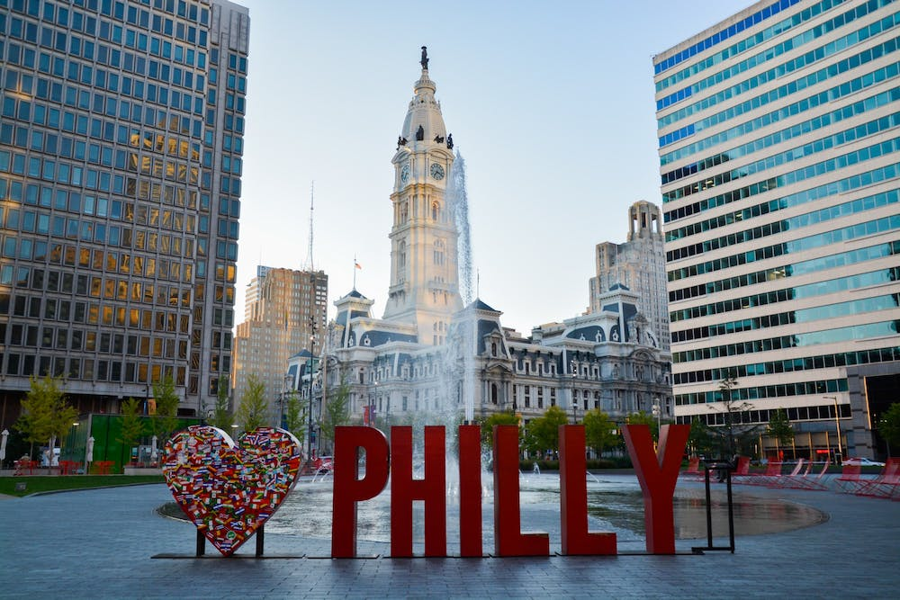

# Best Philly Cuisine Visualization Using Yelp Data Set

#### Contributors: 
Rosie Gianan, Myles Browne, Drew Blankenbiller, Mai Flynn, Ryan Kim, Nitin Kumar

####  Build with: 
Postgres, pgAdmin, Python, Pandas, csv files, json files, HTML, CSS, Flask API, leaflet, Visual Studio Code, Jupyter notebook

tbd: SQLAlchemy ORM, Matplotlib, 

Source Data: https://www.yelp.com/developers/documentation/v3/business

Restricted to Philadelphia only: [Zip Codes - Datasets - OpenDataPhilly](https://www.opendataphilly.org/dataset/zip-codes)

## Objectives:
Yelp is one of the most widely used restaurant and merchant information software across United States and provides us a holistic view about businesses, such as business information and location data, while also giving users an overall review score or ratings based on crowd sourced reviews. 

Our objective is to create an interactive web visualization that analyzes Philadelphia, PA food businesses using the available Yelp businesses json data and OpenDataPhilly. We wanted to only feature the top restaurants, so we are only analyzing and displaying the food businesses with at least a 3.5-star rating in their unique Philly neighborhood.
 
## Solution: {in progress}
business.json - Contains business data including location data, attributes, and categories

ETL:
Our Yelp json provided us with 14569 Philadelphia businesses. We extracted and renamed the columns needed for analysis. We cleaned up the data by dropping unnecessary listings that were not food businesses and only used desired attributes. 

